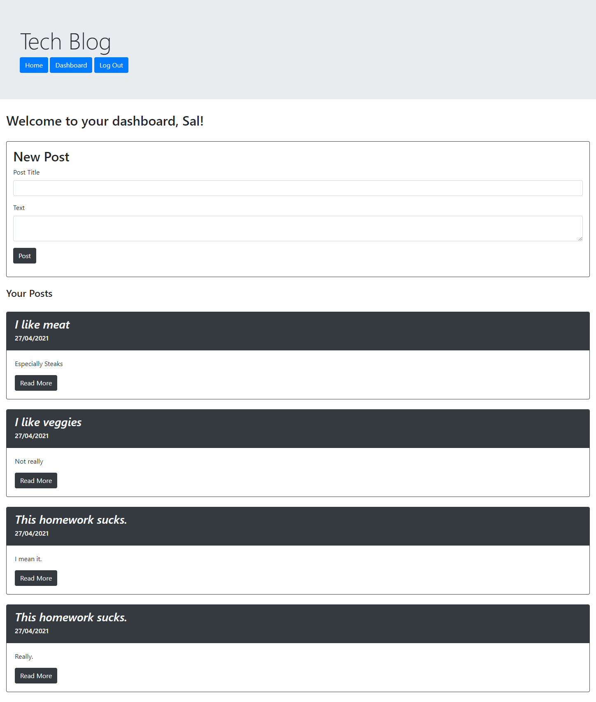
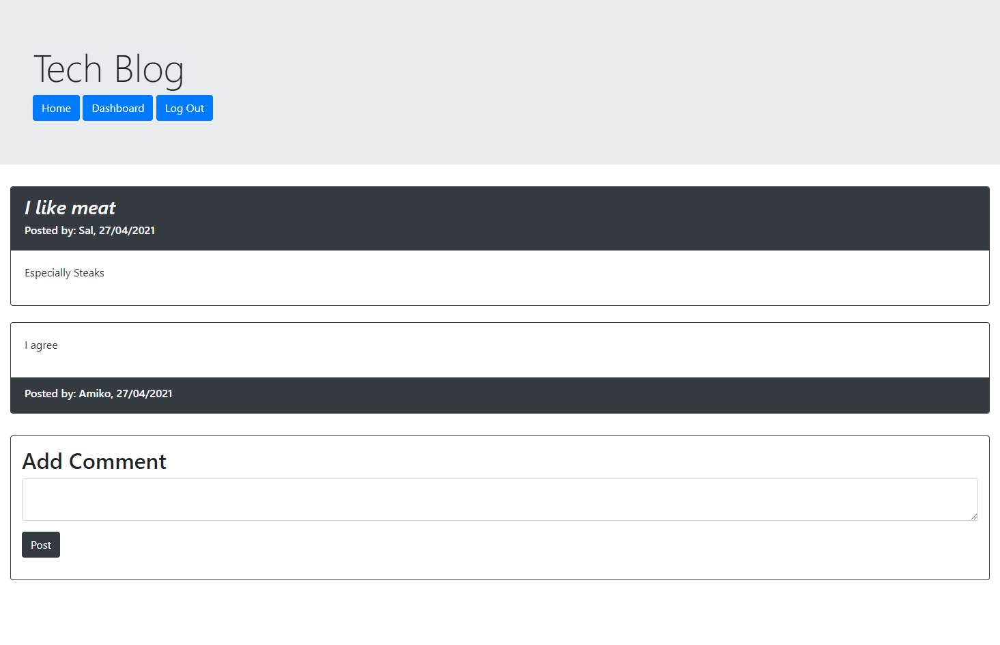

# Tech-Blog

## 

## Table of Contents

- [Description](#Description)
- [Installation Instructions](#Installation-Instructions)
- [Usage Information](#Usage-Information)
- [Contribution Guidelines](#Contribution-Guidelines)
- [Test Instructions](#Test-Instructions)
- [GitHub Page](#GitHub-Page)
- [Questions](#Questions)

## Description

This is tech blog, an app for registered and logged-in users to communicate with each other via posting and commenting on a public forum.

This app is deployed on Heroku and is available at the following link:

https://calm-badlands-67953.herokuapp.com/

## Installation Instructions

```
N/A
```

## Usage Information

Upon reaching the homepage, the user will be shown some of the latest posts populating the page. The user can click on the "read more" button to be redirected to the post to view the posted comments.

In order to start posting themselves, however, users need to log in first, otherwise the post and comment forms will not show up. When trying to visit the dashboard without logging in, the user will be redirected to the login page instead. The user can choose to log in if they already have a registered account, or they can choose to sign up using their email, a username, and a password.

After successfully logging in or signing up, the user will be able to utilize all the functionalities of the site. When going to the dashboard, the user will see the list of their past posts. The user will be able to post either on the homepage or in their dashboard. When viewing a specific post, the user will be able to post their comment.

## Sample Pages

### Dashboard



### Post



## Contribution Guidelines

```
N/A
```

## Test Instructions

```
N/A
```

## GitHub Page

https://github.com/runescape11111/Tech-Blog

## Questions

GitHub profile: github.com/runescape11111/

Email: olivershih@gmail.com
